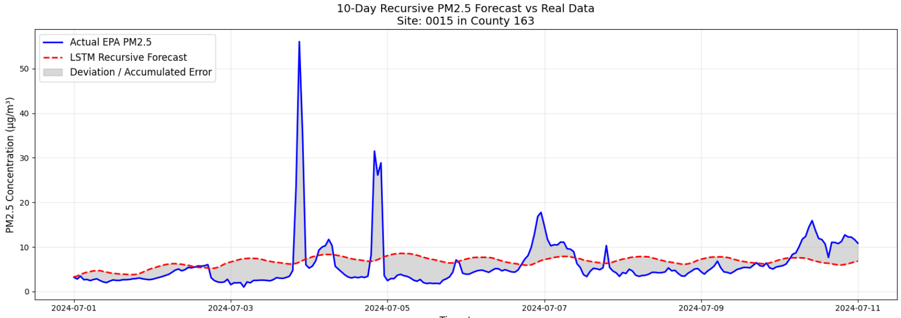
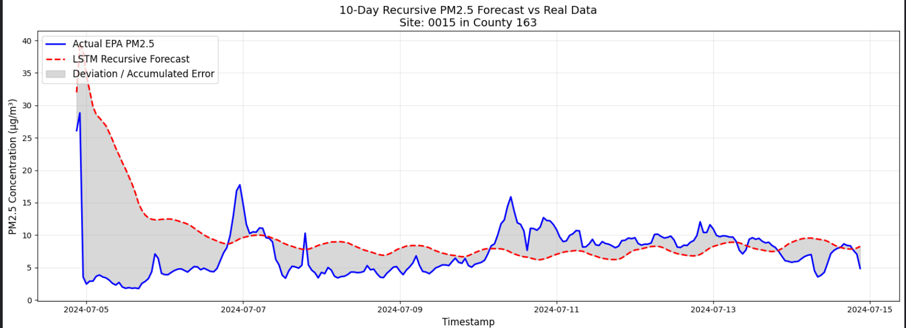

# Air-quality-deeplearning

## Objective

Calculate a long time forecast of PM2.5 using auxiliary features to make hourly forecasts of PM2.5 concentrations.

PM 2.5 particulates are known to be toxic for humans to inhale and gradually degrade the health of the inhabitants, particularly whne levels rise above 12.5. It is important to know how long the PM2.5 concentrations will last in an area to avoid long term damage, thus the existence of this predictive model.

In summary, the model answers the question: 
> If we have a specific date, location and other auxiliary variables and a window of past PM2.5 levels, can we accurately determine how PM2.5 particles will disseminate?

## How

Using a Kaggle notebook to analyze and train a deep learning model to predict air quality (PM2.5) using auxiliary features as reported in [Zhang et al. [1]](#zhang):

- Latitude
- Longitude
- Temperature
- Hour
- Day
- Wind speed

## First (naive) approach - Feed Forward Fully Connected

I decided to see if the model could figure out a relation a relationship between these data points with minimal processing.

I used all the hourly data from every available state in the USA to train the model.

The model consisted of funneling layers and a batch normalization.

The funneling was used due to its reported success on highdimensional data like images by [S. Klein et al. [2]](#klein)

> Crucially the funnel layer allows new transformations to be constructed and could improve the use of exact likelihood methods on tasks that require fast sampling with high dimensional data

Batch normalization was added in hopes to accelerate the learning process as documented in the foundational paper for batch normalization by [S. Ioffe [3]](#ioffe).

```python
import tensorflow as tf
from tensorflow.keras import layers, models

def build_spatial_model(input_shape):
    model = models.Sequential([

        layers.Input(shape=(input_shape,)),
        
        layers.Dense(128, activation='relu'),
        layers.BatchNormalization(), # stabilize rows
        
        layers.Dense(64, activation='relu'),
        layers.Dense(32, activation='relu'),
        
        # Output Layer 1 neuron for PM2.5 level
        # No activation function for regression
        layers.Dense(1)
    ])
    
    model.compile(optimizer='adam', loss='mse', metrics=['mae'])
    return model

model = build_spatial_model(len(features))
```

Despite these approaches, the results were unsatisfactory. After training for 40 epochs, the model showed a very low R-squared.

The data is scaled, so after scaling it back to real world values we obtain:
- Real-World MAE:  4.73 µg/m³
- Real-World MSE:  112.45 (µg/m³)²
- Real-World RMSE: 10.60 µg/m³
- R-squared (R2):  0.1031

### Evaluation Metrics

The evaluation metrics are based on the review paper by [Zhang et al. [1]](#zhang) specifying the main metrics are MAE, RMSE, MAPE, SMAPE and R2

#### MAE

A Mean Absolute Error of 4.73 µg/m³ indicates that, on an average day, the model's prediction is off by about 4.7 µg/m³. This is a reasonable point as prediction but the larger issues stems from the extremely low R-squared.

#### MSE & RMSE

The MSE indicates a *severe* variance in the residuals. The predictions will be off due to unexpected events and this is properly reflected in the RMSE.

RMSE squares the individual errors before averaging them, which **heavily weights large mistakes**. 

RMSE (10.60) is much larger than the MAE (4.73). This proves that on "normal" days, the model might have somewhat acceptable predictions, but it fails to predict extreme pollution events (outliers).

As seen earlier, the data is prone to spikes and there are many other events which will change this:
- Wildfires
- Industrial accidents
- Firework celebrations

Some of these spikes cannot be predicted, which leads to individual prediction errors and a bad RMSE score. This is expected but somewhat large, specially compared to current methods.

#### R2 (r squared)

The R2 score of 0.1031 shows that the model only explains 10.31% of the variance in the PM2.5 data. The remaining 89.69% of the fluctuations in PM2.5 levels are completely missed.

These issues probably stem from the FNN architecture. It treats every single row of data as an independent, isolated event.

### Steps forward

The R2 score is quite telling that our model configuration is not adequate for these predictions. 

After a literature review, there have been reported shortcomings in this funnel architecture and my techniques for spatial-temporal datapoints were lacking.

#### Next goals and approach

I will improve the spatial-temporal interpretation of the data.
In preprocessing, I need to asociate the time and space sequences.

For this next approach I will use a LSTM configuration, so that the model learns the associations between time and space and PM2.5 levels.

LSTM has been reported in the literature as 

## Second approach - LSTM 

Using a LSTM architecture, the model looks like this:

```python
def build_lstm_model(sequence_length, num_features):
    model = models.Sequential([
        layers.Input(shape=(sequence_length, num_features)),
        layers.LSTM(64, return_sequences=False),
        layers.BatchNormalization(),
        layers.Dense(32, activation='relu'),
        layers.Dense(16, activation='relu'),
        layers.Dense(1)
    ])
    model.compile(optimizer='adam', loss='mse', metrics=['mae'])
    return model
```

The data uses a normalization layer to improve convergence during training. The Long Short Term Memory allows the model to correlate the time and space relations within a time series.

I'm now aiming to make a recursive prediction model for PM 2.5 given the previous 7 hours, to see how good the model can actually predict the dissipation and accumulation of PM 2.5.

This *temporal sliding model* approach has been used before and is used as reference to the paper by [W. Mao et al. [4]](#mao)

In the paper, they use it to do a 24 hour prediction but I am quite tempted to make much longer preditcions and see what happens.

### Preprocessing

#### Features and target

In the review literature it has been shown that adding temperature and wind speed [1] to the PM2.5 prediction target improves the model significantly.

```
lstm_features = [
    'latitude', 
    'longitude', 
    'temperature', 
    'wind_speed', 
    'day_sin', 
    'day_cos', 
    'hour_sin', 
    'hour_cos']
target_col = 'pm25_level'
```

#### Cyclical encoding

This approach is used in other time series for multi-step forecasting, see: [Yaroub Elloumi, et al.[5]](#yaroub)

This is necessary for the model to recognize that the data will fluctuate naturally, rather than a linear representation like before. The linear representation introduces artificial distances in data that should be considered contiguous:

> December is right next to January but my previous interpretation gave it a distance of 11 since 12-1 = 11. 

Using sine and cosine functions we can embed periodicity to this data into circles:

1. The hours in a day cycle

```python
hour_sin = np.sin(2 * np.pi * hour_of_day / HOURS_IN_DAY)
hour_cos = np.cos(2 * np.pi * hour_of_day / HOURS_IN_DAY)
```

2. The days in a year cycle

```python
day_sin = np.sin(2 * np.pi * day_of_year / DAYS_IN_YEAR)
day_cos = np.cos(2 * np.pi * day_of_year / DAYS_IN_YEAR)
```

#### Time-space grouping

Data is now clustered around location, using sorted time values. I'm naively using a 7 hour grouping of data so that the model can infer a relation between the series, using the lat and lon pairs as ID's for locations.

Using the features, it then predicts what the 8th hour would look like.

### Model Results

#### Training data characteristics

These statistics were calculated to see if the model behaved better than guessing over the entire dataset.

```
--- Dataset PM2.5 Statistics ---
Historical Mean:      8.28 µg/m³ 
Standard Deviation:   11.10 µg/m³
```

These two show that the air quality on PM2.5 is usually clean, but the random spikes increase the variance, hence the high value of 11.10 µg/m³.

The evaluation tresholds being used help me see if the model is underfitting or overfitting against the Test set.

```
--- Evaluation Thresholds ---
Underfitting Limit (using MAD)  : 5.30 µg/m³
Underfitting Limit (Persistence): 1.12 µg/m³
Overfitting Gap Limit (15% Std) : 1.67 µg/m³
```

##### Model validation data

Using the remaining validation data left to see how the model performs:

```
Training MAE:       1.1777 µg/m³
Validation MAE:     1.1359 µg/m³
Generalization Gap: -0.0418 µg/m³
```

Under these conditions, the model performs worse than the persistence baseline (1.12) against the validation by a small margin.

The great news is that the model presents a small and negative generalization gap, meaning it is still not overfitting. Given that the gap limit is 1.67, there is still room for training. 

#### Model Predictions

I used the model to recursively calculate the next 10 days of EPA PM2.5 concentrations on an arbitrary place in 2024. The model is trained on data from 2018-2021 so it knows nothing of these datapoints.

To my pleasant surprise, the model has a good fit, without accounting for the massive spikes, which are uncontrolled events (4th of july fireworks):

```
--- 10-Day Recursive Window Evaluation ---
Location: State 19, County 163, Site 0015
Period: 2024-07-01 to 2024-07-11
Window MAE:  3.55 µg/m³
Window RMSE: 5.68 µg/m³
```

The MAE window is acceptable under the given fluctuations, since it is much smaller than the historical average of 8.28 µg/m³, so it is better than just guessing.



My real surprise was on this following prediction. I assumed since the model was slightly underfit, that it might have not learnt any patterns, but it *looks like* it did.

I gave the model a point where there was a large spike of PM 2.5 particles to see if the model had learned about PM 2.5 stabilization over time (due to wind and temperature conditions) and it looks like it did!

```
--- 10-Day Recursive Window Evaluation ---
Location: State 19, County 163, Site 0015
Period: 2024-07-04 to 2024-07-14
Window MAE:  4.58 µg/m³
Window RMSE: 7.34 µg/m³
```

The MAE and RMSE windows are larger here due to the 4th of July spikes.



### Steps forward

#### Hyper parameter change

1. Increase the lookback hours in the model. Currently the model only uses 7 hours, I will increase the window to 24 or 48 hours to make sure that the model relates that data to the PM2.5 concentration and dispersal cycles.

Given the abysmal difference between the first model that I tried (which barely improved and did not associate the time series data), it's safe to say this is the right path for prediction.

#### Potentially more training

The overfit gap set to 15%, it might be worth training this model for longer and compare against the [current model baseline](model_checkpoints/current_lstm/pm25_lstm_model_checkpoint_epoch_21.keras).

I particularly fear that the model will start learning overfitting patterns from anomalies like wildfires, however.

#### TS-LSTM with convolution layers

In the literature, there are reports of mixed architectures for prediction so I will look into some of these later and to standardize the findings using DMES framework as reported by [S. Zhou et al. [5]](#zhou)

## Third approach

### 24 hour model lstm (ReLU output + MinMaxScaler)

```python
def build_lstm_model_24hr(sequence_length, num_features):
    model = tf.keras.models.Sequential([
        tf.keras.layers.Input(shape=(sequence_length, num_features)),
        tf.keras.layers.LSTM(64, return_sequences=False),
        tf.keras.layers.BatchNormalization(),
        tf.keras.layers.Dense(32, activation='relu'),
        tf.keras.layers.Dense(16, activation='relu'),
        tf.keras.layers.Dense(1, activation='relu')   # Non‑negative outputs
    ])
    optimizer = tf.keras.optimizers.Adam(learning_rate=0.0005, clipnorm=1.0)
    model.compile(
        optimizer=optimizer,
        loss='mse',
        metrics=['mae', tf.keras.metrics.RootMeanSquaredError(name='rmse')]
    )
    return model
```

### Increased time window

I increased the previous time window to 24 hours, expecting better long time predictions, however the model started to experience recursive decay when predicting: As uncertainty grows, the model will tend towards the average. 

### Scalar changes

I changed the Scaler to MinMax since the datapoints shuld never be negative. This meant changing the scalers, as well as adjusting the last layer to reLu.

### Results for this model

In the short term of a 24 hour prediction, the model has definitely improved against the validation data but it is heavily biased towards the baseline.

[24 hour prediction](/model_checkpoints/lstm_relu_2/24_hr_window.png)

As a mater of fact, the model is so biased towards the baseline that it does not dare change the predictionfor the next points, becoming a flatline.

[Flatlining](/model_checkpoints/lstm_relu_2/flat_line.png)

### Next steps

The next model has to return sequences when using the time series using the time-slide windows with LSTM layers

## Referenced works

<a name="zhang">
[1]
</a>
B. Zhang et al., “Deep learning for air pollutant concentration prediction: A review,” Atmospheric Environment, vol. 290, p. 119347, Dec. 2022, doi: https://doi.org/10.1016/j.atmosenv.2022.119347.
</br>

<a name="klein">
[2]
</a>
S. Klein, J. Raine, S. Pina-Otey, S. Voloshynovskiy, and T. Golling, “Funnels Exact maximum likelihood with dimensionality reduction.” Available: https://bayesiandeeplearning.org/2021/papers/39.pdf
</br>

<a name="ioffe">
[3]
</a>
S. Ioffe, “Batch Normalization: Accelerating Deep Network Training by Reducing Internal Covariate Shift,” 2015. Available: https://arxiv.org/pdf/1502.03167‌
</br>

<a name="mao">
[4]
</a>
W. Mao, W. Wang, L. Jiao, S. Zhao, and A. Liu, “Modeling air quality prediction using a deep learning approach: Method optimization and evaluation,” Sustainable Cities and Society, vol. 65, p. 102567, Feb. 2021, doi: https://doi.org/10.1016/j.scs.2020.102567.
</br>
‌
<a name="zhou">
[5]
</a>
S. Zhou, W. Wang, L. Zhu, Q. Qiao, and Y. Kang, “Deep-learning architecture for PM2.5 concentration prediction: A review,” Environmental science & ecotechnology, pp. 100400–100400, Feb. 2024, doi: https://doi.org/10.1016/j.ese.2024.100400.
</br>
‌
<a name="yaroub">
[6]
</a>
Yaroub Elloumi, Salim Khazem, Ibrahim Krayem, Jeyakaran Mahesananthan. Cyclical Temporal Encoding for
Ensemble Deep Learning in Multistep Energy Forecasting. 2025. ⟨hal-05170016⟩
</br>
